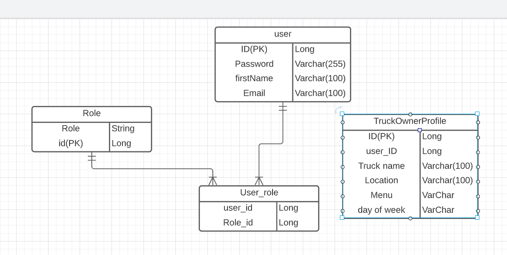
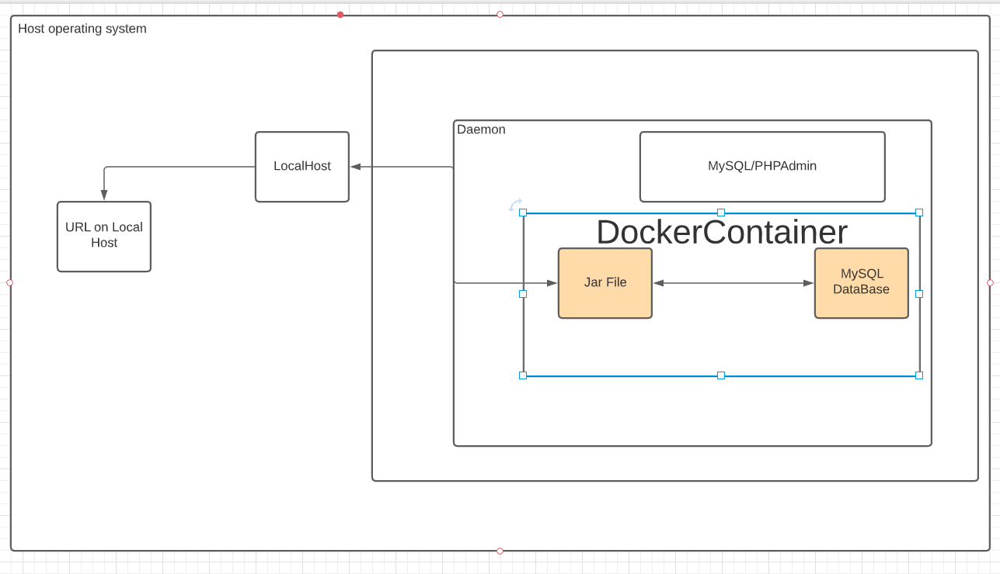
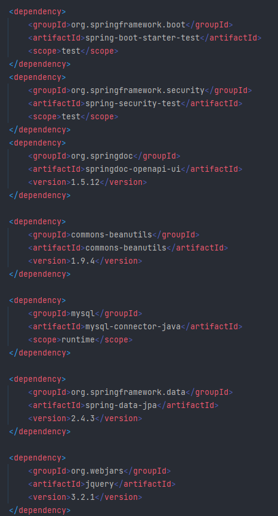
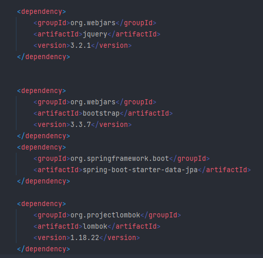
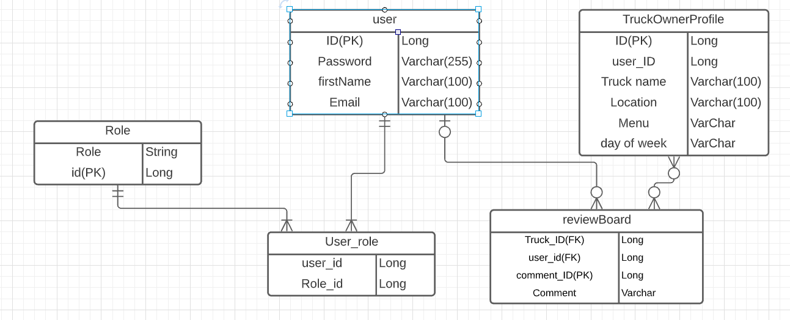

# paypal-java-capstone-project

# Summary of Project:

We are designing a food truck rating app. The purpose of the app is to allow users to create an account and search for local food trucks. The app also allows for truck owners to add and maintain information about their food trucks including things like menus, hours, and future locations. Users will be able to leave a review of the food truck experience.
We start this project using thymeleaf and the thyme leaf security extra dependencies to handle login and role handling. This allowed us to pass POJOS from the backend to the front. The first thing we did was create a user login and registration page. As we ended up needing to use MySQL for the Database and due to system limitation, we decided to use docker file to be able to access MySQL. We then created hidden roles for the admin, which only an admin can see. After we had a working admin page, we move on the creating a truck profile. This took the rest of are time trying to get full CRUD functionality to communicate with the front end.

# User Stories

## Admin

* As an admin I want to be able to list Food trucks. (B)
* As an admin I want to be able to update a Food truck information. (B)
* As an admin I want to be able to Delete a Food truck. (B)

## Customer

* As a user I want to be able to create an account (S)
* As a user I want to be able to view the food truck's details (S)

# ERD

# Docker

# Dependencies Added

## EndPoints :

| http:// Method| Endpoint| Description| Public/User/Admin
|--|--|--|--|
||**TruckProfile**
|Get | http://localhost:8084/foodtrucks | list Food Trucks | Admin
|Get | http://localhost:8084/foodtrucks/add | Render add page | Admin
|post | http://localhost:8084/foodtrucks/save | Saves User information to DataBase | Admin
|Get | http://localhost:8084/foodtrucks/{truckProfileId}/edit | Renders Update page | Admin
|post | http://localhost:8084/foodtrucks/{truckProfileId}/edit | Send updated information to DataBase | Admin
|Get/delete | http://localhost:8084/foodtrucks/{truckProfileId} | pulls the Truck profile and deletes it | Admin

## Resources :

|           Resources                           |        Use                 
|-----------------------------------------------|------------------------------------------|
| thymeleaf.org/doc                             | references on how to setup thymeleaf     |
| github.com/dangeabunea/RomanianCoderExamples  | information on Auth buttons              |
| javaguides.net                                | starting code for login and registration |
| codepen.io/                                   | for testing HTML                         |

## Full URLs For Resources :

* https://github.com/dangeabunea/RomanianCoderExamples/tree/master/SpringBootSecurity       
* https://www.javaguides.net/2018/10/user-registration-module-using-springboot-springmvc-springsecurity-hibernate5-thymeleaf-mysql.html?m=1

# Challenges Faced:
We decided to take on a new technology for us in Thymeleaf. We had gotten pretty good at writing the API CRUD functionality but wanted to challenge ourselves to 
try something new. This allowed for our back end skills to have a visible front end that we hadn't used before during this course. We really wanted to challenge 
ourselves to push beyond what we think we could accomplish. Understanding the difference between the paths used for our endpoints and the paths to the html files
took a little of time getting used to and understanding. 

# Future Plans:

* As an admin I want to be able to delete posts and reviews for malicious/inappropriate content. 
* As a user I want to be able to search for food trucks by name, category or city.
* * As a user I want to be able to leave comments/feedback for the food truck owner.
* As a user I want to be able to leave a rating for the food truck.
* As a user I want to be able to update my review.
* As a user I want to be able to edit my profile
* As a user I want to be able to view my previous reviews
* As a user I want to be able to delete my comment/review.

# What Would We Do Differently?
Much better planning. We would do more research on Thymeleaf and do a more thorough trial run with sample code to better understand the structure. 

## What Did We Learn ? 
|           Technologies           |
|----------------------------------|
| Thymeleaf                        |
| HTML                             |
| Model View Control API FrameWork |
| MySQL                            |
| Docker-compose for MySQL         |
| PHPAdmin                         |

## Technologies Leveraged :

|     Tech. Name     |            Utilization in Project            |
| ------------------ | -------------------------------------------- |
| Bcrypt             | Hashing function stores passwords in DB.     |
| Java 17            | Code language.                               |
| Maven              | Java dependency management.                  |
| MySQL              | SQL DataBase Database.                       |
| Spring Boot        | API framework.                               |
| Spring Security    | Security authentication                      |
| ThymeLeaf          | Frontend website                             |
| Docker             | To run system in a container                 |
| AWS                | For Hosting                                  |